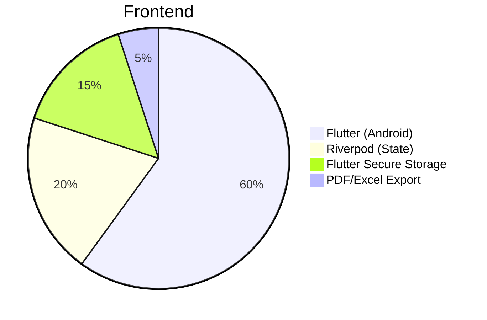
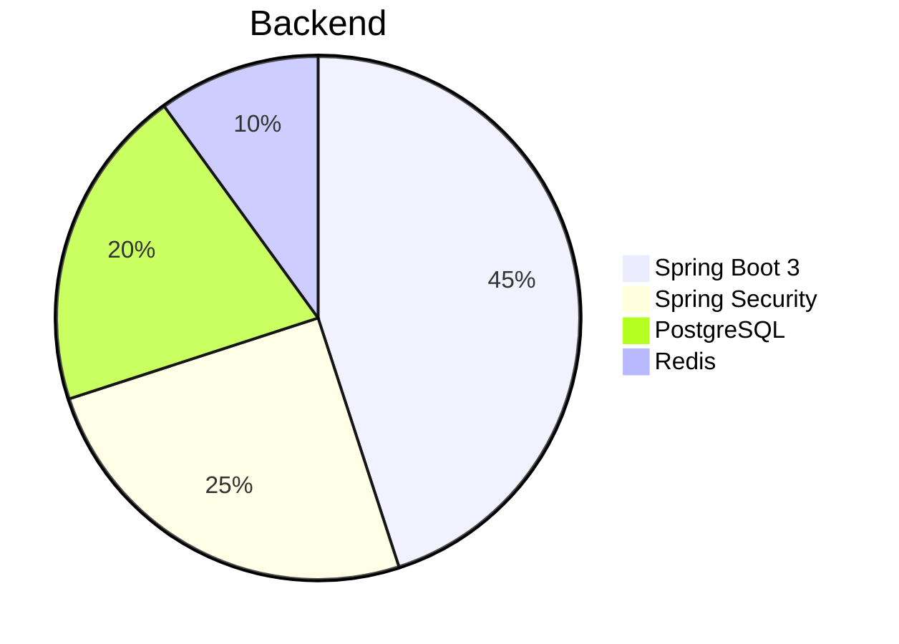
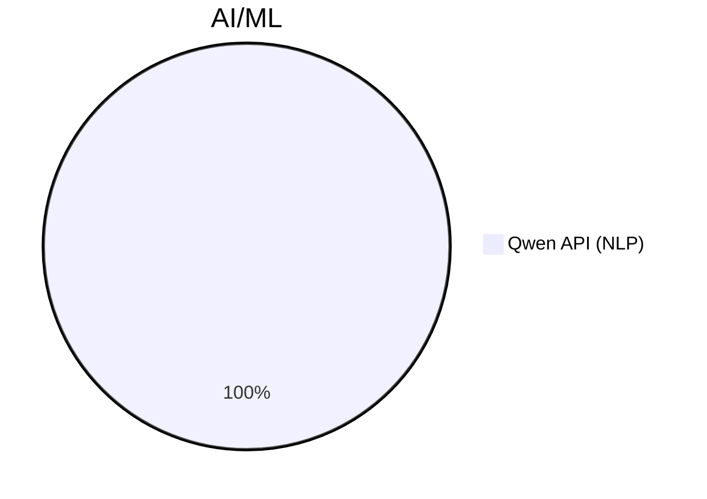
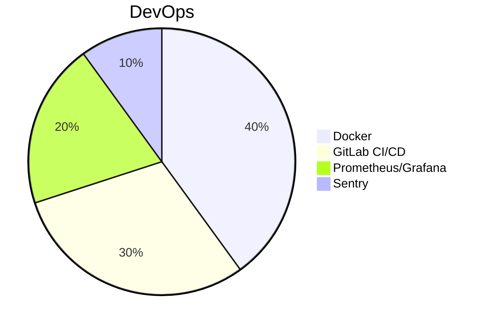

# MoneyGuard

**Умный финансовый ассистент с ИИ для контроля расходов и накоплений**  
 

## 📌 О проекте

MoneyGuard помогает взять под контроль личные финансы через:
- 📝 **Учет операций**: ручной ввод + импорт из Excel/CSV
- 🧠 **ИИ-анализ**: автоматическая категоризация и выявление аномалий
- 🎯 **Цели**: автоматизированные планы накоплений
- 💡 **Рекомендации**: персонализированные советы по оптимизации

## ✨ Ключевые возможности
| Функция | Описание |
|---------|----------|
| 🤖 ИИ-ассистент | Анализ расходов и прогнозирование бюджета |
| 📊 Визуализация | Интерактивные графики и диаграммы |
| 🚀 Быстрый импорт | Загрузка данных из банковских выписок |

## 🛠 Технологический стек

### 📱 Мобильная разработка

### 🖥️ Серверная часть

🤖 Интеллектуальные системы

🛠️ Инфраструктура

